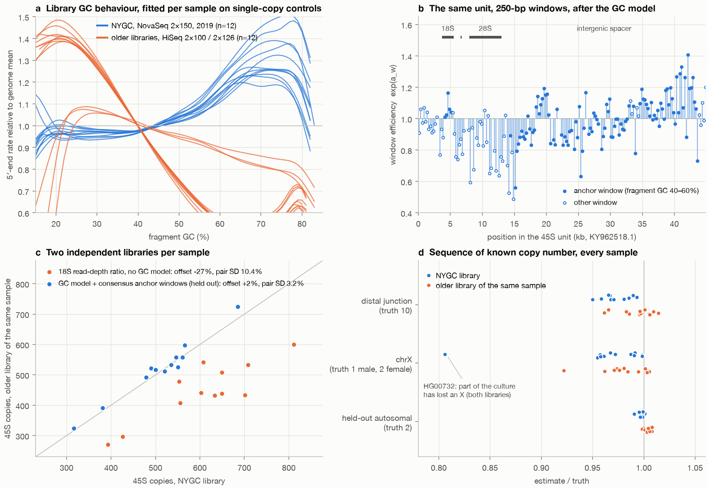
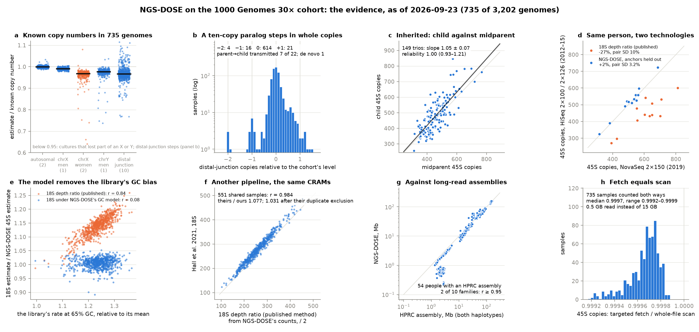

# NGS-DOSE

Sequence-class dosage from short-read WGS: how many 45S rDNA units, 5S units, and copies of
other multi-copy classes a person carries, measured from the GRCh38 CRAMs that biobanks already
hold — in about a minute per genome, without downloading it.

**NGS-DOSE is not a CNV caller.** It measures the part of the genome that variant and CNV callers
mask. [NGS-PCA](https://github.com/jlanej/NGS-PCA) describes a cohort's coverage from the bins it
retains; NGS-DOSE measures what lives in the bins it excludes.

## How it works

```
CRAM ──ngs-dose count──▶ counts.json ──ngsdose estimate──▶ per-sample CN ──ngsdose cohort / adjust / trios──▶ cohort table
        (Rust, htslib)    70-250 kB         (Python, numpy)
```

1. **Count fragment 5′ ends**, in single-copy control regions and in every read that carries
   class-diagnostic 31-mers. A read is assigned to a class, and placed on its unit, by k-mers —
   not by where the aligner put it. `scan` reads the whole file; `fetch` retrieves only the
   control regions and the few *sinks* where a class's reads are known to land (learned from
   scans), and returns the same counts to within what the sinks miss: 0.05% of 45S reads, 0.02%
   of 5S, 0.2% of the distal junction in the samples scanned so far.
2. **Model the library**: a Poisson spline of end density on fragment-scale GC, fitted per sample
   on the controls. Copy number of a window of the unit is `2 × observed / expected`.
3. **Calibrate the unit**: parts of the rDNA unit drop out far beyond what any genome-wide GC
   curve predicts (28S reads ~0.75× of 18S on NovaSeq), and *which* parts depends on the
   sequencing chemistry. Per-window efficiencies are learned per library type, with the scale
   pinned on *anchor* windows where different chemistries were shown to agree.
4. **Check it against known truth in every sample**: held-out autosomal sequence (2 copies),
   chrX (1 or 2), chrY (1 or 0), and the acrocentric distal junction (10 copies), measured by
   the same code paths as the classes. Mitochondrial genomes and EBV episomes per cell come
   along as covariates of the tissue or culture the DNA was taken from.
5. **Cohort layer**: adjustment on coverage PCs (NGS-PCA's, or the control regions' own) - as
   many as clear the noise edge of their spectrum, with a sweep against the known truths to
   confirm or overrule that number - and transmission reliability in trios to decide which
   estimator carries the most real variance.

The reasoning, and the measurements on real data behind each step, are in
[docs/DESIGN.md](docs/DESIGN.md).

## What the pilot shows

Twelve 1000 Genomes samples (four trios, NYGC 30×), each also measured in an independent,
years-older library of the same cell line (HGSVC HiSeq 2500 2×126, or Illumina Platinum HiSeq
2000 2×101) whose GC behaviour is the reverse of NYGC's. Everything was counted in fetch mode
straight from the public CRAMs.

| | |
| --- | --- |
| **Speed** | 60–100 s per 30× genome over HTTPS from a home connection, reading about 0.5 GB of a 15.8 GB CRAM; 3 s from local disk; a whole-file scan takes 1 min 40 s on 10 threads |
| **Known truth** | held-out autosomal sequence 1.996 ± 0.006 (truth 2); chrX in males 0.995 ± 0.004 (truth 1); chrY 0.979 ± 0.004 in males and 0.002 in females (truth 1 and 0); distal junction 9.73 ± 0.13 in the NYGC libraries and 9.93 ± 0.17 in the older ones (truth 10) |
| **Same person, different library** | the 18S depth ratio used in the literature: −27% between library generations, 10% pair-to-pair SD, r = 0.86. NGS-DOSE with anchors chosen out of sample: +2%, 3.2%, r = 0.98 (one sample, no cohort: +0.6%, 4.6%, r = 0.96). These are upper bounds: the two DNA batches come from different cultures |
| **Same CRAMs, published values** | r = 0.98 with Hall et al. 2021 on the shared samples; their values run 8% above ours, 5 points of which are the duplicate flag (DESIGN.md, finding 1) |
| **By-catch** | the controls show HG00732's culture losing an X chromosome (1.84 copies in the 2015 DNA, 1.61 in 2019) |



What it does not show: four trios say nothing about transmission reliability (that is what the
602-trio run is for), no orthogonal assay has calibrated the absolute rDNA scale, and the
window efficiencies and anchors were established on three Illumina chemistries only.

Full tables: [example/1000G/pilot/pilot_report.md](example/1000G/pilot/pilot_report.md).

## What the first 735 genomes show

The cohort run is under way; its counts files and the page built from them accumulate in
[NGS-DOSE-1000G](https://github.com/jlanej/NGS-DOSE-1000G) (live at
[jlanej.github.io/NGS-DOSE-1000G](https://jlanej.github.io/NGS-DOSE-1000G/)). The case that the
method works — known copy numbers read correctly in every genome, a ten-copy paralog that steps
in whole copies and whose steps are inherited, rDNA variation inherited with reliability 1 in
149 trios, the same person agreeing across two sequencing technologies (ICC 0.98, against 0.19
for the 18S depth ratio), r = 0.984 with an independent pipeline on the same files, and a
one-minute fetch that returns 0.9997 of the whole-file scan — is laid out with its numbers, what
each finding rules out, and what is not yet shown, in [docs/EVIDENCE.md](docs/EVIDENCE.md).



## Quick start

From source (the engine needs a Rust toolchain and libclang; the package needs numpy):

```bash
cargo build --release                     # the engine: target/release/ngs-dose
pip install -e .                          # the modelling layer: ngsdose
```

Without compiling: the container has the engine, the package, the GRCh38 bundle, `aria2c` and
the cohort scripts - a cluster needs nothing else but Apptainer and SLURM (`example/1000G`),

```bash
apptainer pull ngs-dose.sif docker://ghcr.io/jlanej/ngs-dose:latest
apptainer exec ngs-dose.sif ngs-dose count --help
```

and a version tag makes a [release](https://github.com/jlanej/NGS-DOSE/releases) that carries the
engine for Linux (glibc 2.28 and newer, curl and TLS built in) and for macOS on Apple silicon,
the Python wheel, and the resource bundle (`export NGSDOSE_RESOURCES=/path/to/resources/GRCh38`).

```bash
B=resources/GRCh38
# one genome, straight from the AWS Open Data mirror (~1 min; CRAM decoding needs the reference)
target/release/ngs-dose count -m fetch -@ 16 \
    -i https://1000genomes.s3.amazonaws.com/1000G_2504_high_coverage/data/ERR3239334/NA12878.final.cram \
    -T GRCh38_full_analysis_set_plus_decoy_hla.fa \
    -p $B/panel.k31.tsv.gz -c $B/controls.fa.gz --sinks $B/sinks.bed -o NA12878.json.gz
```

```bash
ngsdose estimate NA12878.json.gz -o estimates/ -t single_sample.tsv
```

```bash
# cohort: window calibration, coverage-PC adjustment, transmission reliability
ngsdose cohort estimates/*.estimate.json.gz -t cohort.tsv --save-efficiencies efficiencies.json
ngsdose adjust cohort.tsv --pcs ngspca/svd.pcs.txt -c rDNA45S.cn -o cohort.adjusted.tsv   # PCs above the Marchenko-Pastur edge; --n-pc N overrides
ngsdose pcsweep cohort.tsv --pcs ngspca/svd.pcs.txt -c rDNA45S.cn -p pedigree.txt -o sweep.tsv   # known-truth error and transmission for every number of PCs
ngsdose trios cohort.adjusted.tsv -p pedigree.txt -c rDNA45S.cn rDNA45S.cn_single rDNA45S.18S.flat \
    --compare-to rDNA45S.18S.flat       # reliabilities with bootstrap CIs, and paired differences
```

```bash
ngsdose selftest        # simulation checks of the statistics; needs no data
```

```bash
# the cohort page: what is measured and why, and the evidence that it works - known truths in every
# sample, fetch against scan, trios, the cell line - recomputed from whatever counts exist, at any stage
ngsdose report --scan counts_scan/ --fetch counts_fetch/ -p pedigree.txt -o docs/     # -> docs/index.html, report.json, data/*.tsv
```

```bash
# whole-file scan, the full-accuracy mode: placement-independent, the only mode for dispersed sequence (the
# experimental satellite families; the telomeric repeat is fetchable), and a record of where class reads were aligned and
# what else is in those 1-kb bins
E=resources/experimental
target/release/ngs-dose count -m scan -@ 10 -i sample.cram -T ref.fa -c $B/controls.fa.gz -p $B/panel.k31.tsv.gz \
    -p $E/satellites.CHM13v2.k31.panel.tsv.gz -p $E/telomere.k31.panel.tsv.gz -o sample.scan.json.gz
```

A different aligner or decoy set places multi-copy reads differently. Before trusting `fetch`
on a new pipeline, scan a few whole CRAMs and check the sinks:

```bash
ngsdose sinks scan*.json.gz --evaluate $B/sinks.bed      # fraction of each class the sinks capture, per sample
ngsdose sinks scan*.json.gz -o sinks.bed                 # or re-learn them
```

`example/1000G/` runs the whole 1000 Genomes 30× cohort (SLURM or a plain loop) and holds the
pilot; its results - the counts files and the page built from them - accumulate in a repository
of their own, [NGS-DOSE-1000G](https://github.com/jlanej/NGS-DOSE-1000G), published as the run
proceeds. `resources/build/` rebuilds the GRCh38 bundle from public inputs.

## Output columns (per sample)

| column | meaning |
| --- | --- |
| `rDNA45S.cn` | cohort-calibrated diploid copy number (`ngsdose cohort`) |
| `rDNA45S.cn_single` | single-sample headline: anchor windows under the fragment-GC model |
| `rDNA45S.18S`, `.28S`, … / `.flat` | per-feature estimates with / without the GC model; `18S.flat` is the estimator used in the UK Biobank literature |
| `rDNA5S.cn`, `DJ.cn` | 5S units; distal junction (expected 10) |
| `HSat3.mass_Mb`, `ACRO.mass_Mb`, `TEL.mass_Mb`, … | the experimental panels: diploid sequence mass of a satellite family (scan mode) or of the telomeric repeat (either mode; its sinks are in the bundle). How far each is validated: `resources/experimental/README.md` |
| `*.adj` | an estimate with coverage PCs regressed out (`ngsdose adjust`) |
| `truth.auto`, `truth.chrX`, `truth.chrY` | held-out known-copy-number sequence (expected 2; 1 or 2; 1 or 0) |
| `chrM.copies`, `chrEBV.copies` | mitochondrial genomes and EBV episomes per cell: covariates of the state of the tissue or cell line, measured like the truths |
| `engine` | engine version and the commit it was built from, as recorded in the counts file |
| `eof_marker` | `present` unless the input lacked its end-of-file block (the engine refuses such files unless told otherwise) |
| `depth`, `ctrl_dup_frac`, `gc_rel_35`, `gc_rel_65`, `ctrl_region_sd`, `flagged_chromosomes` | library and sample QC; an aneuploid chromosome is reported and excluded from the denominator |
| `*.profile_sd`, `*.profilePC*` | how far the sample's window profile departs from the cohort's |
| `ctrlPC1…`, `ctrlPC_mp` | components of the control regions' residual depth across the cohort: internal technical covariates, usable by `ngsdose adjust` when NGS-PCA has not been run; `ctrlPC_mp` is how many of them stand above the noise edge (what `adjust` uses by default) |
| `gc_curve_max_se` | how well the sample's GC curve is determined (large at very low depth) |

## Status

Engine, estimator, cohort layer and the GRCh38 bundle (45S, 5S, DJ) are implemented and tested:
Rust unit tests, a simulated genome with known truth run end to end, a 2% subsample of real
NA12878 reads, a mock trio cohort (that subsample sixty times over) through the whole cohort
layer, bundle-integrity checks and regression tests on the pilot's counts, all in CI
(Linux and macOS, Python 3.10 to 3.13). Every push to `main` publishes the container image, and
a version tag makes a release with prebuilt engines, the Python package and the resource bundle
(`.github/workflows/`). Before the cohort run every assumption the counts files
rest on was audited against data; nine were wrong and are fixed (DESIGN.md §15). Validated so far on a
12-sample, 4-trio pilot in which every sample has an independent library replicate.
Experimental panels - ten satellite families, which are dispersed and need scan mode, and the
telomeric repeat, which the aligner concentrates and either mode measures - ship under
`resources/experimental/`: in a first comparison with HPRC assemblies
of the same people (two samples) HSat3, HSat1A and the α-satellite HORs come out within 7% of
the assembly; the rest are relative measures or undecided, and that README says which and why.
Not yet done: the cohort run (3,202 samples, 602 trios) and with it the comparison with the 200
HPRC assemblies, sinks for DRAGEN-aligned data, an orthogonal rDNA calibration. See DESIGN.md §12–13. No licence has been chosen yet.

## Provenance and credit

Method design, statistics and implementation were developed by **Claude (Anthropic)** in
September 2026 working sessions with **@jlanej** — first as an offshoot of a review of the
acrocentric short arms (Claude Opus 5), then as the ground-up rewrite in this repository
(Claude Fable 5.1), in which the original specification was tested against real 1000 Genomes
data and largely replaced. The naming, the scoping and the decision to build it are shared; the
errors are worth attributing to the machine that made them until a human has checked each one.

It builds on prior work that should be cited ahead of this repository: NGS-PCA for the exclusion
set behind the controls and for the coverage components; htslib; the T2T-CHM13 assembly and
CenSat annotation; the 1000 Genomes 30× resource (Byrska-Bishop et al., *Cell* 2022); Benjamini &
Speed (*NAR* 2012) for the fragment-GC model; Hall, Turner & Queitsch (*Sci Rep* 2021), whose
per-sample table for the same CRAMs is the external check used here; and Rodriguez-Algarra,
Evans & Rakyan (*Cell Genomics* 2024) for the demonstration that rDNA copy number carries
phenotypic signal. Unit sequences are GenBank KY962518.1 and X12811.1.

Two honesty notes. The transmission-reliability framing is standard midparent regression applied
to a trait whose heritability is one by construction; no claim of novelty is made for it, and no
systematic literature search backs the claims of novelty that *are* made in DESIGN.md §14. And an
AI system is not an author under prevailing journal policy — if this becomes a paper, the
appropriate form is a contributions or acknowledgements statement describing what was
machine-generated, with human authors taking responsibility for verification.
